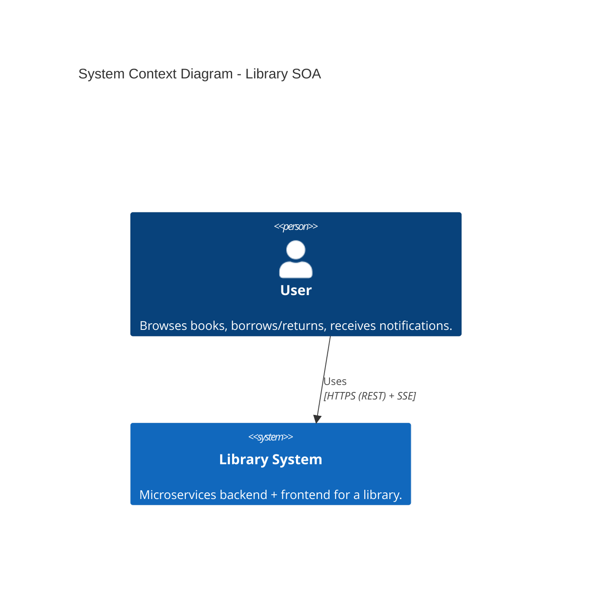
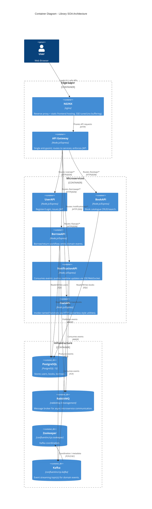
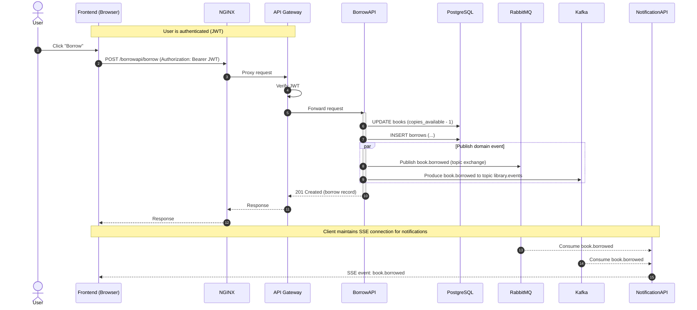

# Library SOA System Documentation

This repository contains a Service-Oriented Architecture (SOA) **Library System** implemented as multiple Node.js microservices, fronted by an **API Gateway** and **NGINX**.

The system demonstrates:

- Secured REST APIs (JWT)
- Multiple microservices (User, Book, Borrow, Notifications, FaaS)
- Async communication via **RabbitMQ**
- Event streaming via **Kafka**
- Real-time server-side notifications via **SSE (Server-Sent Events)**
- Containerized deployment with Docker Compose

---

## 1. System Overview

The Library system is designed as a set of independently deployable services:

- **UserAPI** issues JWT tokens (login/register) and provides user endpoints.
- **BookAPI** exposes book catalogue endpoints.
- **BorrowAPI** handles borrow/return logic and emits domain events (`book.borrowed`, `book.returned`).
- **NotificationAPI** consumes events and pushes real-time notifications to clients.
- **FaaSAPI** exposes a small “serverless-style” function invocation API (`/invoke/:name`).
- **API Gateway** is the single public entrypoint for the backend and enforces JWT for protected routes.
- **NGINX** reverse-proxies everything on port `8080` and is configured for correct SSE streaming.

---

## 2. C4 Model: System Context

This diagram shows how a user interacts with the Library system. Authentication is done using JWT, validated at the API Gateway.

> Note: Mermaid C4 diagrams require Mermaid C4 support in your renderer.



---

## 3. C4 Model: Container Diagram

This diagram breaks down the internal containers in the docker-compose stack.



---

## 4. UML Sequence Diagram: The "Borrow Book" Flow

This diagram describes the synchronous borrow request and the asynchronous notification pipeline.



---

## 5. Technology Stack Summary

| Component | Technology | Role |
|---|---|---|
| Reverse Proxy | NGINX | Single public entrypoint; proxies APIs; hosts frontend; SSE-friendly proxy config |
| API Gateway | Node.js + Express + http-proxy-middleware | JWT validation + routing to services |
| Microservices | Node.js + Express | UserAPI, BookAPI, BorrowAPI, NotificationAPI, FaaSAPI |
| Database | PostgreSQL 15 | Persistent storage for users/books/borrows |
| Message Broker | RabbitMQ | Async event delivery between services |
| Event Streaming | Kafka (+ Zookeeper) | Event stream for domain events (`library.events`) |
| Real-time Notifications | SSE (Server-Sent Events) | Server → browser streaming notifications |
| Deployment | Docker Compose | Runs full system locally in containers |

---

## 6. Run Locally (Quick Start)

From the backend folder:

```powershell
Set-Location "./library-system/backend"
docker compose up -d --build
```

Open:

- Frontend: `http://localhost:8080`
- Gateway health: `http://localhost:8080/health`

